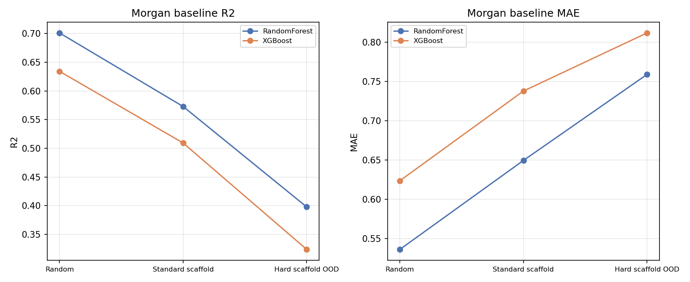
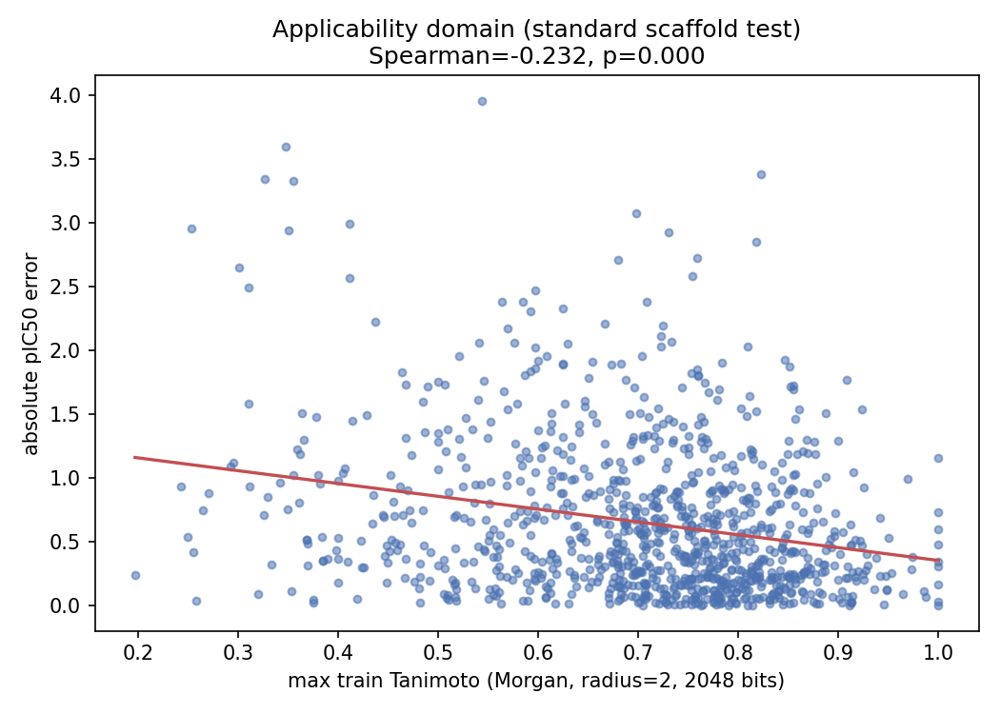
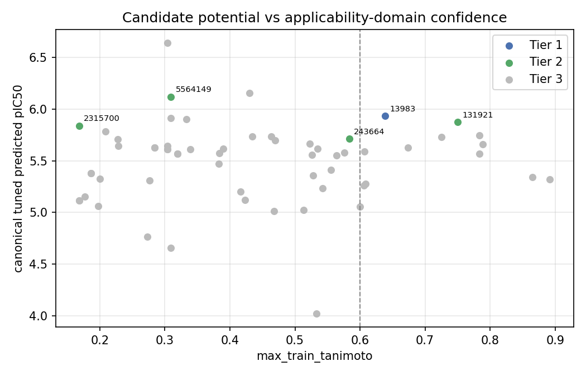
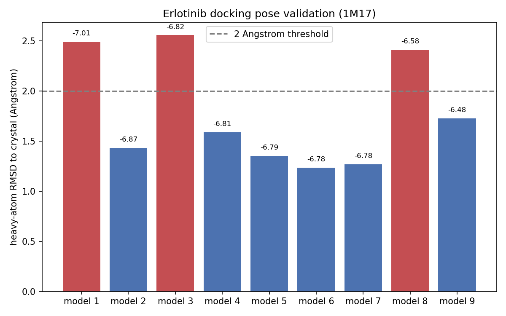

# EGFR AI-Driven Virtual Screening

End-to-end computational drug discovery for EGFR inhibitors: ChEMBL data
curation, molecular representation benchmarking, scaffold-aware validation,
applicability-domain analysis, virtual screening, external robustness
testing, ADMET filtering, and AutoDock Vina docking.


**Quick summary:** Morgan fingerprints + Random Forest are the strongest and
most robust baseline in this project. Model performance drops as evaluation
moves toward more chemically distinct scaffolds, and error increases as test
molecules become less similar to the training chemistry. Ranking remains
useful even in lower-similarity regions, but external transferability is
substantially weaker than internal scaffold-aware performance.

## Key Results

| Result | Value |
|---|---:|
| Curated EGFR IC50 dataset | 10,161 molecules (ChEMBL CHEMBL203) |
| Standard scaffold split, baseline Morgan-RF | R2 0.573 / Spearman 0.759 |
| Standard scaffold split, final tuned Morgan-RF | R2 0.592 / Spearman 0.766 |
| Hard scaffold OOD stress test | R2 0.398 / Spearman 0.651 |
| Retrospective screening | ROC-AUC 0.885, PR-AUC 0.918, EF1% 1.713 |
| External set (59 records, 5 seeds) | RF Spearman +0.206 mean, 5/5 positive |
| Erlotinib redocking | best RMSD 1.238 A, 6/9 poses < 2 A |

## Final Candidate Result

The closing study prioritized 60 non-training candidates by convergent
evidence from prediction, 25 frozen-model stability runs, applicability
domain, physicochemical properties, and docking. Tier 1 is
**CHEMBL13983**; Tier 2 is CHEMBL5564149, CHEMBL131921, CHEMBL2315700, and
CHEMBL243664. These are hypotheses for experimental validation, not
confirmed inhibitors.

See [final_candidate_shortlist.csv](results/final_candidate_shortlist.csv),
[final_candidate_evidence_matrix.csv](results/final_candidate_evidence_matrix.csv),
and [final_candidate_prioritization_summary.json](results/final_candidate_prioritization_summary.json).

## Dataset

EGFR (Epidermal Growth Factor Receptor, UniProt P00533 / ChEMBL CHEMBL203)
is a receptor tyrosine kinase frequently deregulated in cancer. The modeling
dataset contains **10,161 curated molecules** with a continuous `pIC50`
activity endpoint, downloaded from ChEMBL and restricted to exact EGFR IC50
measurements. Units are normalized to nM, SMILES are validated and
standardized with RDKit, and repeated measurements are aggregated by median.

* Dataset: [egfr_activity_final.csv](data/processed/egfr_activity_final.csv)
* Provenance: [data_processing_summary.json](results/data_processing_summary.json)
* Attribution: [data/README.md](data/README.md)

## Methods

Three molecular representations were benchmarked under identical splits:

| Representation | Models |
|---|---|
| Morgan fingerprints (radius 2, 2048 bits) | RandomForest / XGBoost |
| Molecular graphs | GCN / GIN |
| SMILES token sequences | Transformer encoder |

The learned graph/sequence models did not consistently outperform the Morgan
fingerprint baseline. The final Morgan-RF configuration was selected on a
scaffold validation split (radius 2, 2048 bits, 300 trees,
`max_features = 0.20`, seed 42) and then evaluated once on the untouched
standard-scaffold test set.

* Configuration: [final_rf_configuration.json](results/final_rf_configuration.json)
* Test results: [final_rf_test_results.json](results/final_rf_test_results.json)
* Protocol: [METHODS_AND_DECISIONS.md](docs/METHODS_AND_DECISIONS.md)

## Generalization

| Split | Morgan-RF | R2 | Spearman |
|---|---|---:|---:|
| Random 80/20 | baseline | 0.701 | 0.837 |
| Standard scaffold 80/10/10, seed 42 | baseline | 0.573 | 0.759 |
| Standard scaffold 80/10/10, seed 42 | final tuned | 0.592 | 0.766 |
| Hard scaffold OOD 80/20 | baseline | 0.398 | 0.651 |

All splits are leakage-free at the scaffold level. The hard split is
deliberately extreme: all 2,033 test scaffolds are singletons. Across five
alternative whole-Murcko-scaffold partitions, the tuned model improved both
Spearman and R2 in 5/5 splits
([repeated_scaffold_split_summary.json](results/repeated_scaffold_split_summary.json)).



## Applicability Domain

For every standard-scaffold test molecule, `max_train_tanimoto` is the
maximum Morgan Tanimoto similarity to any training molecule.

* `Spearman(max_train_tanimoto, absolute_error) = -0.232 (p < 1e-10)`
* MAE increases monotonically from **0.507** (similarity >= 0.8) to
  **1.068** (similarity < 0.4)
* Ranking remains useful even at lower similarity: ROC-AUC 0.944 for
  similarity >= 0.6 vs 0.858 for similarity < 0.6



## Virtual Screening and External Robustness

The pipeline screens a ChEMBL-derived candidate library
([egfr_candidate_library.csv](data/candidates/egfr_candidate_library.csv))
with Morgan-based and learned models, then re-ranks with the more defensible
RandomForest model. The four known positive controls (afatinib, erlotinib,
gefitinib, lapatinib) rank 1-4 under the locked model and are recovered 4/4
in the top 5, top 10, and top 20
([final_known_inhibitor_summary.json](results/final_known_inhibitor_summary.json)).
This is a necessary but not sufficient sanity check; the retrospective
screening benchmark
([m9_retrospective_benchmark.json](results/m9_retrospective_benchmark.json))
is the primary evidence of ranking quality.

External labels are 59 heterogeneous ChEMBL IC50 records, a transferability
stress test rather than a gold standard. Across five seeds, RandomForest
external Spearman is positive in 5/5 seeds (mean +0.206), while the
RF + Transformer ensemble is positive in only 3/5 seeds (mean +0.024):
[p03_multiseed_reproducibility.json](results/p03_multiseed_reproducibility.json).

## Docking

ADMET descriptors (Lipinski, Veber, ESOL, QED) filter the shortlist, and
AutoDock Vina docks 20/20 shortlist molecules against EGFR 1M17
(rigid receptor, box centered on co-crystallized erlotinib). The setup is
validated by redocking erlotinib: best RMSD **1.238 A**, with 6/9 Vina poses
below 2 A ([m9_pose_validation.json](results/m9_pose_validation.json)).





## Reproducibility

```bash
conda env create -f environment.yml
conda activate egfr-aidd

python src/models/final_rf_confirmation.py
python src/models/final_candidate_prioritization.py   # 25 frozen-model fits
```

Docking requires the separate `egfr-aidd-dock` environment and an
AutoDock Vina 1.2.x executable installed separately. Fixed seeds: split 42,
model 42, multi-seed audit {42, 7, 123, 2024, 777}. Full commands, package
versions, and regeneration notes are in
[REPRODUCIBILITY.md](docs/REPRODUCIBILITY.md).

## Limitations

All results are retrospective; no prospective or wet-lab validation was
performed. External transferability is substantially weaker than internal
scaffold-aware performance, Vina scores and ADMET descriptors are
approximations, and final candidates remain hypotheses. See
[LIMITATIONS.md](docs/LIMITATIONS.md) for the full list.

## Repository Structure

```text
.
├── README.md
├── environment.yml              # modeling environment
├── environment-docking.yml      # docking environment
├── data/
│   ├── processed/               # final curated molecule-level dataset
│   ├── candidates/              # virtual-screening candidate library
│   └── docking/                 # receptor, prepared receptor, docking box
├── notebooks/
│   ├── 01_egfr_dataset_qc.ipynb
│   ├── 03_morgan_split_comparison.ipynb
│   └── 06_virtual_screening.ipynb
├── src/
│   ├── data/                    # download + preprocessing
│   ├── models/                  # core pipeline and final evaluation scripts
│   └── utils/                   # shared helpers
├── results/
│   ├── figures/                 # selected final figures
│   └── *.json / *.csv           # compact final summaries and evidence tables
└── docs/
    ├── PROJECT_SUMMARY.md
    ├── METHODS_AND_DECISIONS.md
    ├── REPRODUCIBILITY.md
    └── LIMITATIONS.md
```

## Documentation

* [PROJECT_SUMMARY.md](docs/PROJECT_SUMMARY.md)
* [METHODS_AND_DECISIONS.md](docs/METHODS_AND_DECISIONS.md)
* [REPRODUCIBILITY.md](docs/REPRODUCIBILITY.md)
* [LIMITATIONS.md](docs/LIMITATIONS.md)

Representative notebooks: [dataset QC](notebooks/01_egfr_dataset_qc.ipynb),
[scaffold split comparison](notebooks/03_morgan_split_comparison.ipynb), and
[virtual screening](notebooks/06_virtual_screening.ipynb).
