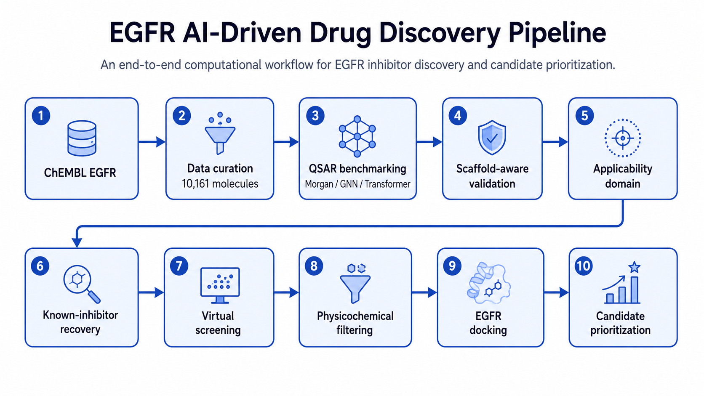
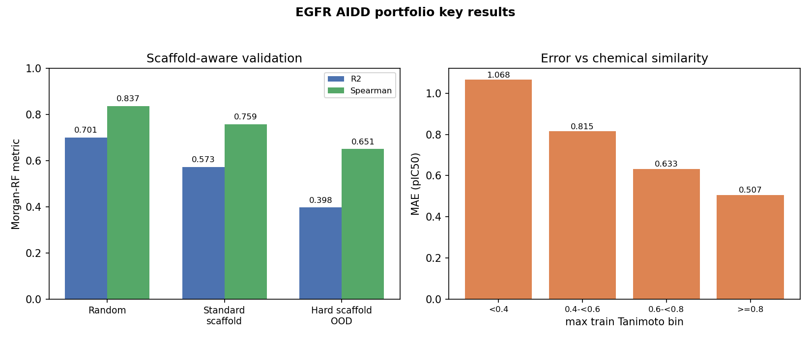

# EGFR AI-Driven Drug Discovery Pipeline

An end-to-end computational drug discovery project for EGFR inhibitors:
ChEMBL data curation, molecular representation benchmarking, scaffold-aware
validation, applicability-domain analysis, virtual screening, external
robustness testing, ADMET filtering, and AutoDock Vina docking.





**Quick summary:** Morgan fingerprints + Random Forest are the strongest and
most robust baseline in this project. Model performance drops as evaluation
moves toward more chemically distinct scaffolds, and error increases as test
molecules become less similar to the training chemistry. Ranking remains
useful even in lower-similarity regions, but external transferability is
substantially weaker than internal scaffold-aware performance.

---

## 1. Project Overview

This repository is an independent, portfolio-quality AIDD project that:

1. curates a molecule-level EGFR IC50 dataset from ChEMBL;
2. benchmarks three molecular representations: Morgan fingerprints,
   molecular graphs (GCN/GIN), and a SMILES Transformer;
3. evaluates generalization with random, standard scaffold, and hard
   scaffold OOD splits;
4. analyzes chemical applicability domain via Morgan Tanimoto similarity;
5. runs virtual screening, retrospective screening benchmarks, external
   validation, and multi-seed robustness checks;
6. filters candidates with ADMET descriptors and docks them with AutoDock
   Vina;
7. validates the docking setup by redocking the erlotinib co-crystal.

The full scientific write-up is in
[docs/portfolio_hardening_analysis.md](docs/portfolio_hardening_analysis.md);
the recruiter-facing summary is in
[docs/FINAL_PROJECT_SUMMARY.md](docs/FINAL_PROJECT_SUMMARY.md).

## 2. Biological Target and Dataset

EGFR (Epidermal Growth Factor Receptor, UniProt P00533 / ChEMBL CHEMBL203)
is a receptor tyrosine kinase frequently deregulated in cancer. Approved
EGFR inhibitors include gefitinib, erlotinib, afatinib, and lapatinib.

The modeling dataset contains **10,161 curated molecules** with a continuous
`pIC50` activity endpoint, downloaded from ChEMBL and restricted to EGFR
IC50 measurements.

## 3. Data Curation

The M1 pipeline keeps only exact IC50 measurements, normalizes all units to
nM, validates and standardizes SMILES with RDKit (largest fragment +
canonical SMILES), and aggregates repeated measurements by median pIC50.
Every step is auditable in `results/data_processing_summary.json`.
Data sources and third-party attribution are documented in
[data/README.md](data/README.md).

## 4. Molecular Representation Benchmarking

Three representations were compared under identical splits:

| Representation | Model | Course connection |
|---|---|---|
| Morgan fingerprint (radius=2, 2048 bits) | RandomForest / XGBoost | RDKit fingerprints |
| Molecular graph | GCN / GIN | GNNs |
| SMILES token sequence | Transformer encoder | NLP / Transformer |

Under this dataset and training regime, the learned graph/sequence models
did **not** consistently outperform the simple Morgan fingerprint baseline.
Multi-seed analysis (`results/p03_multiseed_reproducibility.json`)
confirmed that RandomForest is the most stable model.

The Morgan-RF configuration was finalized through a controlled, one-factor
hyperparameter study (validation-based selection, standard scaffold test
untouched during selection):

* Morgan radius 1-3 and nBits 512-4096 were broad performance plateaus;
  radius 2 and 2048 bits were retained.
* Increasing `min_samples_leaf` monotonically reduced validation
  performance; `max_depth` showed a high-depth plateau above 60. Both
  defaults were retained.
* Moderate feature subsampling (`max_features=0.10-0.20`) was the only
  change that robustly improved scaffold-held-out validation, confirmed
  across five RF seeds.
* The locked final configuration uses `max_features=0.20`; the original
  default (`max_features=1.0`) is retained below as the explicit baseline.

See [docs/final_rf_model_selection.md](docs/final_rf_model_selection.md),
[results/final_rf_configuration.json](results/final_rf_configuration.json),
and [results/final_rf_test_results.json](results/final_rf_test_results.json).

## 5. Generalization Evaluation

Three evaluation settings are used. **Standard scaffold split is the
primary QSAR benchmark**; hard scaffold OOD is a stress test; random split
is shown only as an optimistic comparison.

| Split | Type | Morgan-RF model | R2 | Spearman |
|---|---|---|---:|---:|
| Random (80/20) | optimistic in-distribution | original default (mf=1.0) | 0.701 | 0.837 |
| Standard scaffold (80/10/10, seed 42) | primary scaffold-aware | original default (mf=1.0) | 0.573 | 0.759 |
| Standard scaffold (80/10/10, seed 42) | primary scaffold-aware | **final tuned (mf=0.20)** | **0.592** | **0.766** |
| Hard scaffold OOD (80/20) | extreme unseen-scaffold stress test | original default (mf=1.0) | 0.398 | 0.651 |

The final tuned model was locked before the standard scaffold test was
evaluated. Its gain over the original default on that test set is small but
reproducible: test RMSE 0.863 vs 0.883, R2 0.592 vs 0.573, Spearman 0.766
vs 0.759 (paired bootstrap 95% CI excludes zero for RMSE, R2, and
Spearman). Full numbers are in
[results/final_rf_test_results.json](results/final_rf_test_results.json);
per-molecule predictions are in
[results/final_rf_test_predictions.csv](results/final_rf_test_predictions.csv).
Across five alternative whole-Murcko-scaffold partitions (seeds 7/21/42/123/
2024), the tuned model improved both Spearman and R2 in 5/5 splits (mean
`ΔSpearman +0.006`, mean `ΔR2 +0.013`); the canonical seed-42 standard
scaffold test numbers above remain the headline.

All splits are leakage-free at the scaffold level. The hard split is
deliberately extreme: all 2,033 test scaffolds are singleton scaffolds.
Retrospective screening remains strong even there (RandomForest ROC-AUC
0.885, PR-AUC 0.918, EF1% 1.713).

## 6. Applicability Domain

For every standard-scaffold test molecule, `max_train_tanimoto` is the
maximum Morgan Tanimoto similarity to any training molecule.

* `Spearman(max_train_tanimoto, absolute_error) = -0.232 (p < 1e-10)`
* MAE increases monotonically from **0.507** in the `>=0.8` similarity bin
  to **1.068** in the `<0.4` bin.
* Ranking remains useful even at lower similarity: ROC-AUC 0.944 for
  similarity >=0.6 vs 0.858 for similarity <0.6.

## 7. Virtual Screening

The pipeline screens the ChEMBL-derived candidate library with
Morgan-based and learned models, then re-ranks with the more defensible
RandomForest model (multi-seed RF is recommended over the seed-sensitive
RF+Transformer ensemble). Positive controls rank highly, which is a
necessary but not sufficient sanity check; the retrospective screening
benchmark is the primary evidence of ranking quality.

## 8. External Robustness

External labels are 59 heterogeneous ChEMBL IC50 records; this is a
transferability stress test, not a gold standard. Across five seeds:

* RandomForest external Spearman mean **+0.206**, positive in **5/5** seeds.
* Equal-weight RF+Transformer ensemble mean +0.024, positive in 3/5 seeds.
* Single-seed ensemble gains were **not reproducible** across seeds.

External performance is substantially weaker than internal scaffold-aware
performance, which is documented rather than hidden.

## 9. Physicochemical Filtering and Docking

ADMET descriptors (Lipinski, Veber, ESOL, QED) filter the shortlist, and
AutoDock Vina docks 20/20 shortlist molecules against EGFR 1M17. The docking
setup is validated by redocking the erlotinib co-crystal:

* best redocking RMSD = **1.238 Angstrom**;
* **6/9** Vina poses have RMSD < 2 Angstrom.

### Final Candidate Prioritization

The closing candidate study considered only **non-training** candidates (60
eligible molecules after excluding known controls) and prioritized them by
convergent evidence from prediction, 25 frozen-model stability runs,
applicability domain, physicochemical properties, and docking. Tier 1 is
CHEMBL13983; Tier 2 is CHEMBL5564149, CHEMBL131921, CHEMBL2315700, and
CHEMBL243664. These candidates are hypotheses for experimental validation,
not confirmed EGFR inhibitors. Full rationale:
[docs/final_candidate_prioritization.md](docs/final_candidate_prioritization.md).

## 10. Key Findings

* Random splitting is optimistic relative to scaffold-aware evaluation.
* Morgan-RF is the strongest and most robust baseline in this project.
* More complex learned representations did not consistently outperform
  Morgan fingerprints under the current dataset/training regime.
* Quantitative prediction reliability decreases with chemical novelty.
* Ranking ability remains useful even in lower-similarity regions.
* External transferability is substantially weaker than internal
  scaffold-aware performance.
* Single-seed ensemble gains were not reproducible; multi-seed analysis
  favored RandomForest.
* RF ensemble diversity mattered more than direct tree simplification:
  radius/nBits changes and leaf/depth regularization produced plateaus or
  worse validation performance, while `max_features=0.10-0.20` consistently
  improved scaffold generalization across five RF seeds and transferred
  partially to the held-out scaffold test.
* Docking geometry was validated through erlotinib co-crystal redocking.

## 11. Limitations

* All results are retrospective; no prospective or wet-lab validation.
* Morgan Tanimoto is representation-dependent; similar structures can still
  show activity cliffs.
* Assay heterogeneity affects activity labels.
* Vina scores are screening approximations, not true binding affinities.
* ADMET descriptors are rule-based, not experimental measurements.
* The standard scaffold split is one deterministic realisation.
* Hyperparameter decisions were made sequentially on one fixed scaffold-
  validation partition, so repeated adaptive use of that validation split
  may introduce some model-selection bias. The final locked model was
  therefore evaluated without further adjustment on the scaffold test set;
  the standard scaffold test set was not used during the controlled
  hyperparameter-selection study.

## 12. Reproducibility / How to Run

```bash
# Main modeling environment
conda env create -f environment.yml
conda activate egfr-aidd

# Docking environment (rdkit + meeko + openbabel)
conda env create -f environment-docking.yml
conda activate egfr-aidd-dock
```

### Quick Start

From the project root, with the `egfr-aidd` environment active, two
representative commands reproduce the final locked RF test evaluation and
the final candidate shortlist:

```bash
python src/models/final_rf_confirmation.py
python src/models/final_candidate_prioritization.py
```

The second command runs 25 frozen-model stability fits and takes several
minutes. Docking requires the separate `egfr-aidd-dock` environment and a
separately installed AutoDock Vina 1.2.x executable on PATH (or passed via
the docking scripts' CLI argument); Vina is not redistributed in this
repository.

From the project root, with the `egfr-aidd` environment active:

```bash
python src/data/download_chembl.py          # needs internet (ChEMBL)
python src/data/preprocess_egfr.py
python src/models/morgan_baseline.py
python src/models/evaluate_splits.py
KMP_DUPLICATE_LIB_OK=TRUE python src/models/graph_baseline.py
KMP_DUPLICATE_LIB_OK=TRUE python src/models/smiles_transformer.py
KMP_DUPLICATE_LIB_OK=TRUE python src/models/virtual_screening.py
python src/models/p03_external_label_audit.py
python src/models/portfolio_hardening_analysis.py
python src/models/final_portfolio_figures.py
python src/models/final_rf_confirmation.py   # locked final Morgan-RF test evaluation
```

Docking scripts run with `conda activate egfr-aidd-dock`:

```bash
python src/models/m7_docking.py --top-n 20
python src/models/m9_docking_pose_validation.py
```

Fixed seeds: split seed 42, model random_state 42, multi-seed audit uses
{42, 7, 123, 2024, 777}. Results JSONs record package versions, indices, and
parameters. The controlled M2 tuning scripts are
`src/models/radius_tuning_study.py`,
`src/models/nbits_tuning_study.py`,
`src/models/min_samples_leaf_tuning_study.py`,
`src/models/max_features_tuning_study.py`,
`src/models/max_features_low_range_study.py`,
`src/models/max_features_multiseed_study.py`, and
`src/models/max_depth_tuning_study.py`; their results are in `results/` and
`docs/`.

## 13. Repository Structure

```text
egfr-aidd-project/
├── README.md
├── environment.yml
├── environment-docking.yml
├── data/
│   ├── raw/          # downloaded ChEMBL files
│   ├── interim/      # auditable preprocessing stages
│   ├── processed/    # final molecule-level dataset
│   ├── candidates/   # virtual-screening candidate library
│   └── docking/      # receptor, box (Vina installed separately)
├── notebooks/
│   ├── 01_egfr_dataset_qc.ipynb
│   ├── 02_morgan_baseline.ipynb
│   ├── 03_morgan_split_comparison.ipynb
│   ├── 04_molecular_graph_baseline.ipynb
│   ├── 05_smiles_transformer.ipynb
│   └── 06_virtual_screening.ipynb
├── src/
│   ├── data/          # download + preprocessing
│   ├── models/        # all milestone + portfolio scripts
│   └── utils/         # shared helpers
├── results/
│   ├── figures/       # milestone + final figures
│   ├── *.json         # auditable metrics and split definitions
│   └── models/        # trained model artifacts (git-ignored)
└── docs/
    ├── FINAL_PROJECT_SUMMARY.md
    ├── portfolio_hardening_analysis.md
    ├── final_rf_model_selection.md
    ├── archive/         # development history / roadmap
    └── README_M*.md   # milestone reports
```
